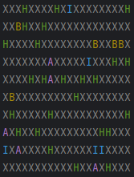
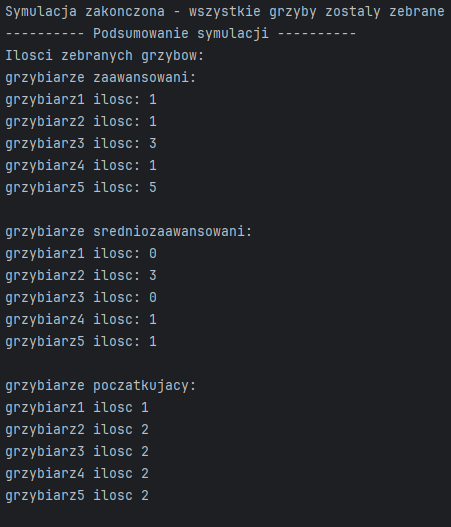

# Simulation of Mushroom Picking

### This is a Java-based simulation of mushroom picking.
The simulation uses predefined parameters such as the total number of mushrooms,
the percentage of poisonous and hallucinogenic mushrooms,
the number of pickers at different experience levels, and the size of the map.

Inside the repo you can find shell script named: _*runForest.sh*_
It is running the simulation 100 times for different sizes of Forest.

### There are three types of mushroom pickers:
1. **Beginner** – Picks all mushrooms without distinction. Dies after picking a poisonous one. Does not pick hallucinogenic mushrooms.
2. **Intermediate** – Has a 50% chance to pick poisonous or hallucinogenic mushrooms. Risk of death from both.
3. **Advanced** – Picks only edible and hallucinogenic mushrooms. Dies after picking a hallucinogenic mushroom.

The simulation ends when one of the defined conditions is met (e.g. no mushrooms or pickers left). At the end, a summary shows how many mushrooms each picker collected and whether they survived.

All picker types inherit from an abstract `mushroom_picker` class.

1. After each iteration of simulation board with forest is printed for user to see
how mushroom pickers are picking the mushrooms.

2. All of the simulation results are printed at the end of terminal.

